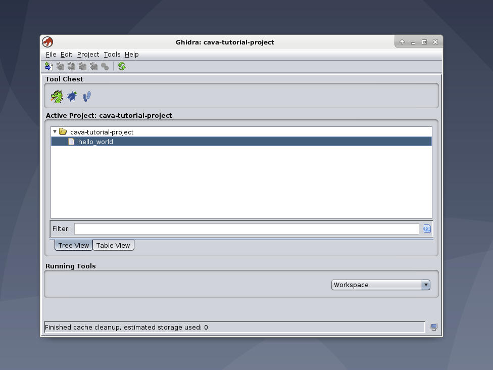

# Before We Start

We assume the reader has familiarity with vagrant, the experiment environment, and the development environment. While the guide is high level, we suggest that the reader have a basic understanding of bash and be comfortable using the command line.

Before we can start on how to create a custom Ghidra project for your own experiment, we first need to start the experiment environment.

Run `vagrant up` in your terminal while the working directory is `/cava-public-release/cava-platform`. The output from the command should list the status of provisioning; please wait until provisioning finishes or you might encounter issues.

After provisioning finishes, the virtual machine should look something like the following:

Once the experiment environment is running, we can start working on creating a custom project.

# Creating Ghidra Project

First open `Ghidra 10`; there is a shortcut on the experiment environment desktop.

After opening `Ghidra 10`, left-click the `File` header and the left-click the `New Project` entry. Here's an image on where it's located:

Left-click the `Non-Shared Project` radio button and hit `Next`.

Now, *Do Not Change* `Project Directory`. We will be using this path at a later step and changing this will make command line arguments not work correctly. We will name our project `cava-tutorial-project`. Left-click `Finish` when you are done.

## Importing a Binary

Now we're back to where we were earlier. What we're going to do now is import a new binary and make some changes to it for our experiment.

Left-click the `File` header and then left-click the `Import File...` entry. A file manager should open. Afterwards, navigate to the path `/vagrant/cava-platform/binary-sample/` and left-click the `hello-world` *binary*. Finally, left-click the `Select File to Import` button at the bottom of the file manager. Keep the default settings and left-click the `OK` button. You should see a results summary. Left-click the `OK` button to continue.

Your project should look something like this at this point:

Let's open the project now. Left-click the `hello_world` binary and drag it to the green dragon. This should open the main `Ghidra` tool. `Ghidra` will ask if you want to analyze the binary. Run the analysis now since we don't want every subject to have to run this step themselves. This also guarantees that all subjects have the same labels. Like before, keep the default settings unless you know what you're doing!

`Ghidra` should look something like this:

## Modifying Binary for Experiment

Now that we have our binary loaded, we are going to make some comments and relabel some variables for our experiment. First, we are going to navigate to where we print "Hello World!". There are multiple ways to do this but let's keep it simple. Open the `Defined Strings` tool by left-clicking on the `Window` header and selecting the tool. After that, double left-click the "Hello World!" entry in `Defined Strings` and the Code Browser and Decompiler will change context to where "Hello World!" is located. Double left-click the XREF and the context will change to the main function.

Now that we are at `main`, we are going to relabel the function to `main`. Change the function signature to match `int main(void)`. Next, we are going to make a precomment before the print statement that says "This line prints "Hello World!"". You should have something that looks like the following:

## Changing Tool Layout for Experiment

Since we are going to be running a specific set of tasks that use certain tools, we are going to change the default layout and export it for our experiment.

First, we are going to move and change some window sizes and open up the `Defined Strings` and `Comments` tools. We are also going to remove the `Function Graph` tool since we're not going to be using it in our experiment. We are going to stack `Defined Strings` and `Comments` under the `Decompiler` tool. We'll leave the rest of the tools in place. At the end we should have something like the following:

Now we are going to keep our experiment layout by saving it. Left-click the `File` header and left-click the `Save tool As...` entry. Now rename the tool to `CavaExperimentTool` and choose the red dragon for the tool icon. Now we export the tool by left-clicking the file header and left-clicking the entry `Export` then `Export Tool`. The file manager will pop-up. Keep the default options and export the tool at `/home/vagrant` with the file name being `CavaExperimentTool`.

We are done with our custom project. Close out Ghidra and **SAVE CHANGES**. If you don't then the analysis and changes we made won't take effect. In the next section we will package the necessary files in order for our experiment platform to automactically set up `Ghidra` correctly.

## Packing Files for the Experiment Platform

Now we are going to save the Ghidra Project we just made for our experiment. First, open a terminal on the experiment virtual machine. Then, change directories to `/vagrant/` and run the following commands:

1. `./collect-current-ghidra-config.sh`
2. `mv ./CavaExperimentTool.tool /vagrant/bootstrap/ghidra`

Lastly, check that the files were moved and updated by changing directories to `/vagrant/bootstrap/ghidra` and running `ls -l *.tgz` and `ls -l CavaExperimentTool.tool`. Take note of the modification date and make sure it makes sense.

