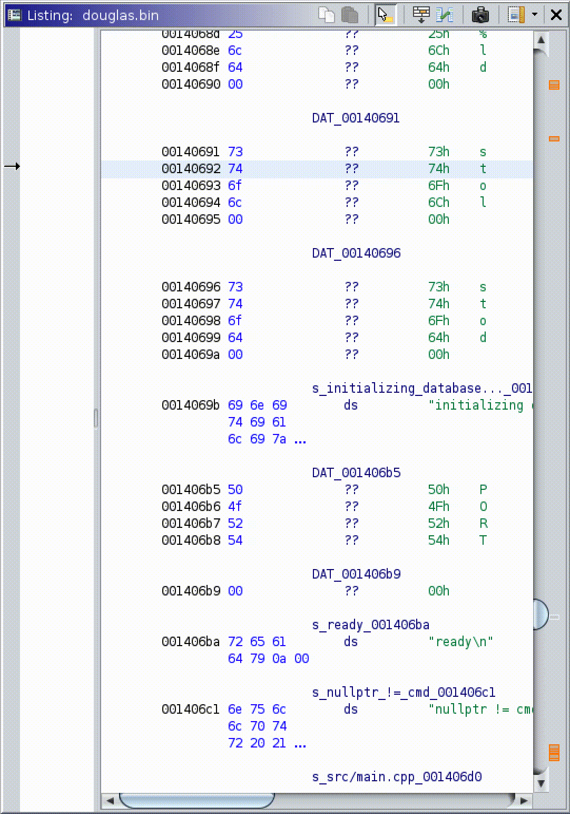

# Internal Instrumentation

Internally instrumented events are generated as a user interacts with Ghidra's user interface.  These events represent the result of keyboard and mouse interactions that have triggered a change in a Ghidra user interface component and as such are key to understanding how a user's interactions are driving the Ghidra toolset. Under the hood, these events are generated from Ghidra plugins which have been instrumented by injecting new Java AWT and Swing event listeners into components that are likely to be interacted with. This instrumentation is not comprehensive, but focused on key components and interactions that are expected to be used within our experimental tasks. While this approach to internal instrumentation is lightweight, it does require creating and maintaining instrumented versions of key plugins (and running these instrumented plugins in the place of the default plugins).  Due to the dynamic nature of the Ghidra interface, most of the internal instrumentation is injected dynamically by traversing the Java component hierarchy each time a new plugin or view is loaded into the interface. This results in a great amount of flexibility and relative ease in including additional instrumentation. Instrumented plugin classes are written for portability and each subclass has a primary core Ghidra plugin. Running an instrumented Ghidra is as easy as loading a couple of additional Ghidra plugins into a matching version of the Ghidra RE toolkit.  While this approach is somewhat brittle if an underlying Ghidra plugin were to change substantively, the instrumentation is easy to work with and update over time, enabling a low maintenance cost to update plugins as the Ghidra environment evolves in future releases. 

| Event                                                                                                                                                                             | Description                                                     | Ghidra | Code Browser | Decompile | Function Graph | Cantor Dust | Task Instr. | Task Survey |
|-------------------------------------------------------------------------------------------------------------------------------------------------------------------------------------|-------------------------------------------------------------------|----------|----------------|-------------|------------------|---------------|---------------|---------------|
| Ghidra Location Changed                 | Currently viewed program location based on navigation actions   | X      | X            | X         | X              | X           | -           | -           |
| Ghidra Selection Changed               | Currently selected text within a plugin context                 | X      | X            | X         | X              | X           | -           | -           |
| Ghidra Highlight Changed               | Change in highlighted text within a plugin context              | X      | X            | X         | X              | X           | -           | -           |
| Ghidra Unhandled Plugin                 | Captures remaining Ghidra-generated plugin events               | X      | X            | X         | X              | X           | -           | -           |
| Vertical Scrollbar Adjustment     | Vertical Scrollbar value updates                                | -      | X            | X         | X              | -           | X           | X           |
| Horizontal Scrollbar Adjustment | Horizontal Scrollbar value updates                              | -      | X            | X         | X              | -           | X           | X           |
|  Mouse Entered                 | Mouse enters the plugin’s outer JComponent                      | -      | X            | X         | X              | X           | X           | X           |
|  Mouse Exited                   | Mouse exits the plugin’s outer JComponent                       | -      | X            | X         | X              | X           | X           | X           |
|  Mouse Pressed                 | Mouse button is pressed                                         | -      | X            | X         | X              | X           | X           | X           |
|  Mouse Released               | Mouse button is released                                        | -      | X            | X         | X              | X           | X           | X           |
|  Mouse Clicked                 | Mouse button is clicked                                         | -      | X            | X         | X              | X           | X           | X           |
| Field Input                                        | Field value is changed                                          | -      | X            | -         | X              | -           | -           | -           |
| Field Location                                  | Field location is updated                                       | -      | X            | -         | X              | -           | -           | -           |
| Field Mouse                                        | Field is interacted with the mouse                              | -      | X            | -         | X              | -           | -           | -           |
| Field Selection                                | Field is selected                                               | -      | X            | -         | X              | -           | -           | -           |
| Heartbeat                                    | Periodic heartbeat for verification of instrumentation activity | -      | -            | -         | -              | -           | X           | -           |
| Visual Marker                                 | Indicate when visual markers are updated in the visualization   | -      | -            | -         | -              | X           | -           | -           |
| Task Initialize                         | Task is initialized but not started [state 0 -> state 1]        | -      | -            | -         | -              | -           | X           | -           |
| Task Next                                                 | Task is ready [state 1 -> state 2]                              | -      | -            | -         | -              | -           | X           | -           |
| Task Start                                                | Task has started [state 2 -> state 3]                           | -      | -            | -         | -              | -           | X           | -           |
| Task Incomplete                                     | Task is started but incomplete - [state 3 -> state 4]           | -      | -            | -         | -              | -           | X           | -           |
| Task Finish                                             | Task is finished - [state 4 -> state 1 \| state 5]               | -      | -            | -         | -              | -           | X           | -           |
| Experiment Complete                        | Experiment is complete, all tasks are finished [state 5]        | -      | -            | -         | -              | -           | X           | -           |
| Task Survey Finish                                | Intra-task survey is finished.                                  | -      | -            | -         | -              | -           | -           | X           |
| Task Survey Start                                  | Intra-task survey is started.                                   | -      | -            | -         | -              | -           | -           | X           |

In the table: "X" indicates a previously implemented instrumentation; "N" indicates new instrumentation, and "-" indicates not applicable for the component.

## Logging Information

Internal instrumentation and external log messages are saved to "lsl_data.json" while the experiment is running. This documentation is going to be focused on internal logs sent to lsl_data.json from java. However, python external documentation has a separate log file named "GhidraClickLogs.log" and keyboard mouse events are saved in "KeyboardMouseListener.log". These logs are also included in lsl_data.json, but they will not be discussed here.

There are several common fields in many/all of the logs generated. These are "inner" json dictionary keys. A list of the outermost keys can be found below. The "EventSource" key tells us which window the event occurred or the plugin name. The "Timestamp" key provides us with the time as Ghidra sees it. The "InstrumentationType" key will always be "Internal" for these events discussed here as they were generated internally in Ghidra. The "EventName" key gives information on the event that happened. For example, a TaskSurveyStartEvent will have event name with value "Task Survey Start", while a mouse event will have event name "MOVE". 

Events have information pertaining to that event that is not in all log messages. For example, the mouse events have coordinates of the location of the mouse, while function graph events have information on the vertex, addresses, vertex title, etc.

## Events

**GraphDistanceEvent**:

* Description: During POV and POI tasks we have a vulnerable address in the metadata.json files. Every time the user clicks on a new address in ghidra the "CavaPerformanceMetrics.java" code is run, computing the assembly distance, graph block distance, and function distance. 
* Action to Cause: Clicking on any address in POV/POI tasks. The task must  have a vulnerable address.
* Unique Fields: "descriptor" - This will be "FOUND", "NOT FOUND", or "NOT CONNECTED". "FOUND" means we successfully found the distances, the fields will be populated. Both "NOT FOUND" and "NOT CONNECTED" will have -1 in the distances, however for different reasons. "NOT FOUND" implies the two addresses function distance was so great that the code wasn't able to identify the path. This could be caused by a timeout or by the function distance being greater than a pre-set variable. "NOT CONNECTED" implies that we found the function distance between vulnerable address and clicked address (could already be in the same function), however we failed to find a path through the function graph connecting the two addresses. This is common with if/else statements which don't logically connect. Also, "TaskDescription" is a short description detailing what is significant about the address we found the distance for. For simple training tasks it just mentions the  task type, for vulnerabilities it details the vulnerability type.
* Event Author: Unknown User (johnsonj)
* Examples:
    * Distances found:
    {"GraphDistanceEvent":{"Timestamp":1649175843.9295449,"InstrumentationType":"Internal","EventSequenceNumber":1741,"EventSource":"CavaDecompilePlugin",
    "EventName":"GraphDistanceEvent","EventType":"GRAPH_DISTANCE_EVENT","EventTrigger":"INTERNAL_ONLY","ProgramName":"bryant.bin","taskID":260,"TrialID":1,
    "TaskUUID":"cd76e355-4baf-460e-9942-bdc345f38898","ClickedAddress":"0060c0a8","KeyAddress":"00402477","AssemblyDistance":82,"BlockDistance":2,
    "FunctionDistance":2,"Descriptor":"FOUND", "TaskDescription": "Null Pointer Dereference"}}
    * Addresses Not Connected:
    {"GraphDistanceEvent":{"Timestamp":1649175819.7305250,"InstrumentationType":"Internal","EventSequenceNumber":1512,"EventSource":"CavaFunctionGraphPlugin",
    "EventName":"GraphDistanceEvent","EventType":"GRAPH_DISTANCE_EVENT","EventTrigger":"INTERNAL_ONLY","ProgramName":"bryant.bin","taskID":250,"TrialID":1,
    "TaskUUID":"c29d6c0f-6cb2-4d08-b3f8-dc689103dfc9","ClickedAddress":"0040790d","KeyAddress":"0040797e","AssemblyDistance":-1,"BlockDistance":-1,
    "FunctionDistance":-1,"Descriptor":"NOT CONNECTED", "TaskDescription": "Null Pointer Dereference"}}

**GhidraLocationChangedEvent**:

* Description: Any time an address is clicked on, that address is reported
* Action to Cause: Click on an address
* Unique Fields: 
    * Byte Address
    * Row
    * Column
    * CharOffset
    * IsNullLocation
* Example: 
    {"GhidraLocationChangedEvent":{"Timestamp":1646078277.5344040,   "InstrumentationType":"Internal","EventSequenceNumber":17,"EventSource":"CavaCodeBrowserPlugin",
    "EventName":"GhidraLocationChangedEvent","EventType":"GHIDRA_LOCATION_CHANGED_EVENT","EventTrigger":"INTERNAL_ONLY","ProgramName":"douglas.bin","TaskID":0,"TrialID":0,
    "TaskUUID":"","ByteAddress":"00100000","Row":0,"Column":0,"CharOffset":0,"IsNullLocation":false}}
* GIF Example:
    

**GhidraSelectionChangedEvent**

* Description: Currently selected text within a plugin context
* Action to Cause: Make a selection within plugin context
    * Unique Fields: 
    * MinSelectionAddress
    * MaxSelectionAddress
    * NumberOfSelectionRanges
    * IsNullSelection
* Example: 
    {"GhidraSelectionChangedEvent":{"Timestamp":1646079704.2331719,"InstrumentationType":"Internal","EventSequenceNumber":3633,"EventSource":"CavaDecompilePlugin",
    "EventName":"GhidraSelectionChangedEvent","EventType":"GHIDRA_SELECTION_CHANGED_EVENT","EventTrigger":"INTERNAL_ONLY","ProgramName":"douglas.bin","TaskID":190,"TrialID":1,
    "TaskUUID":"0915a839-ac64-46f4-ae01-380892d54754","MinSelectionAddress":"00110269","MaxSelectionAddress":"00110269","NumberOfSelectionRanges":1,"IsNullSelection":false}}

**GhidraProgramActivatedEvent**

* Description: Program has been selected and opened in Ghidra
* Action to Cause: Open a program in Ghidra
* Unique Fields: 
    * IsNullProgram
* Example: 
    {"GhidraProgramActivatedEvent":{"Timestamp":1646078276.3921371,"InstrumentationType":"Internal","EventSequenceNumber":8,"EventSource":"ProgramManagerPlugin",
    "EventName":"GhidraProgramActivatedEvent","EventType":"GHIDRA_PROGRAM_ACTIVATED_EVENT","EventTrigger":"INTERNAL_ONLY","ProgramName":"douglas.bin","TaskID":0,"TrialID":0,
    "TaskUUID":"","IsNullProgram":false}}

**GhidraUnhandledPluginEvent**

* Description: Captures remaining Ghidra-generated plugin events
* Action to Cause: 
* Unique Fields: 
    * N/A
* Example: 
    {"GhidraUnhandledPluginEvent":{"Timestamp":1646078275.6802061,"InstrumentationType":"Internal","EventSequenceNumber":6,"EventSource":"ProgramManagerPlugin",
    "EventName":"Program Opened","EventType":"GHIDRA_UNHANDLED_PLUGIN_EVENT","EventTrigger":"INTERNAL_ONLY","ProgramName":null,"TaskID":0,"TrialID":0,
    "TaskUUID":""}}

**VerticalScrollbarAdjustmentEvent**

* Description: Vertical scrollbar value updates
* Action to Cause: Move the vertical scrollbar of a window with the cursor, scroll wheel, or window movement out of current scope
* Unique Fields: 
    * ScrollbarLocation
* Example: 
    {"VerticalScrollbarAdjustmentEvent":{"Timestamp":1643745066.9301181,"InstrumentationType":"Internal","EventSequenceNumber":7398,"EventSource":"CavaCodeBrowserPlugin",
    "EventName":"VerticalScrollbarAdjustmentEvent","EventType":"VERTICAL_SCROLLBAR_ADJUSTMENT","ProgramName":"bryant.bin","TaskID":300,"TrialID":1,
    "TaskUUID":"7bc42fbd-dea0-4e9d-b05b-5c591d76a1ef","ScrollbarLocation":443129}}
* GIF Example
    

**HorizontalScrollbarAdjustmentEvent**

* Description: Horizontal Scrollbar value updates
* Action to Cause: Move the horizontal scrollbar of a window with the cursor, scroll wheel, or window movement out of current scope
* Unique Fields: 
    * ScrollbarLocation
* Example: 
    {"HorizontalScrollbarAdjustmentEvent":{"Timestamp":1646079873.2527461,"InstrumentationType":"Internal","EventSequenceNumber":4059,"EventSource":"CavaCodeBrowserPlugin",
    "EventName":"HorizontalScrollbarAdjustmentEvent","EventType":"HORIZONTAL_SCROLLBAR_ADJUSTMENT_EVENT","EventTrigger":"AdjustmentEvent","ProgramName":"douglas.bin","TaskID":220,"TrialID":1,
    "TaskUUID":"6bb36164-cc23-4d50-a32f-696aefc987cc","ScrollbarLocation":42}}
* GIF Example
    

**CavaListenerHeartbeat**

* 	Description: Heartbeat event that is sent every X seconds via a set interval - Periodic heartbeat for verification of instrumentation activity
* 	Action to Cause: Automatic, set interval between events
* 	Unique Fields: 
    * N/A
* 	Event Author: Jonathan Buch
* 	Example: {"CavaListenerHeartbeatEvent":{"Timestamp":1646078272.5147810,"InstrumentationType":"Internal","EventSequenceNumber":1,"EventSource":"CavaListenerPlugin",
"EventName":
    "CavaListenerHeartbeat","EventType":"CAVA_LISTENER_HEARTBEAT_EVENT","EventTrigger":"INTERNAL_ONLY","ProgramName":null,"TaskID":0,"TrialID":0,
    "TaskUUID":""}}

**MousePressedEvent**

* 	Description: Mouse button is pressed (Separate from a MouseClickedEvent, Button1 is held down)
* 	Action to Cause: Mouse button is pressed
* 	Unique Fields: 
    * MouseButton
    * ClickCount
    * RelativeX
    * RelativeY
    * AbsoluteX
    * AbsoluteY
    * Button1Down
    * Button2Down
    * Button3Down
* 	Example: 
    {"MousePressedEvent":{"Timestamp":1646078284.6823361,"InstrumentationType":"Internal","EventSequenceNumber":34,"EventSource":"CavaTaskSequencingPanel_ActionButton",
    "EventName":"MousePressedEvent","EventType":"MOUSE_PRESSED_EVENT","EventTrigger":"MouseEvent","ProgramName":"douglas.bin","TaskID":0,"TrialID":0,
    "TaskUUID":"","MouseButton":1,"ClickCount":1,"RelativeX":202,"RelativeY":17,"AbsoluteX":755,"AbsoluteY":1039,"Button1Down":true,"Button2Down":false,"Button3Down":false,"CtrlDown":false,
    "AltDown":false,"ShiftDown":false,"MetaDown":false,"IsPopupTrigger":false,"Modifiers":1024,"ModifiersText":"Button1"}}
* GIF Example
    

**MouseClickedEvent**

* Description: Mouse button is clicked (Separate from a MousePressedEvent)
* Action to Cause: Mouse button is clicked
* Unique Fields: 
    * MouseButton
    * ClickCount
    * RelativeX
    * RelativeY
    * AbsoluteX
    * AbsoluteY
    * Button1Down
    * Button2Down
    * Button3Down
* Example: 
    {"MouseClickedEvent":{"Timestamp":1646078285.0821309,"InstrumentationType":"Internal","EventSequenceNumber":39,"EventSource":"CavaTaskSequencingPanel_ActionButton",
    "EventName":"MouseClickedEvent","EventType":"MOUSE_CLICKED_EVENT","EventTrigger":"MouseEvent","ProgramName":"douglas.bin","TaskID":0,"TrialID":0,
    "TaskUUID":"","MouseButton":1,"ClickCount":1,"RelativeX":202,"RelativeY":17,"AbsoluteX":755,"AbsoluteY":1039,"Button1Down":false,"Button2Down":false,"Button3Down":false,"CtrlDown":false,
    "AltDown":false,"ShiftDown":false,"MetaDown":false,"IsPopupTrigger":false,"Modifiers":0,"ModifiersText":""}}
* GIF Example
    

**MouseReleasedEvent**

* Description: Mouse button is released (following a MousePressedEvent)
* Action to Cause: Mouse button is released
* Unique Fields: 
    * MouseButton
    * ClickCount
    * RelativeX
    * RelativeY
    * AbsoluteX
    * AbsoluteY
    * Button1Down
    * Button2Down
    * Button3Down
* Example: 
    {"MouseReleasedEvent":{"Timestamp":1645130039.4721031,"InstrumentationType":"Internal","EventSequenceNumber":711,"EventSource":"CavaFunctionGraphPlugin_ListingPanel",
    "EventName":"MouseReleasedEvent","EventType":"MOUSE_RELEASED_EVENT","ProgramName":"douglas.bin","TaskID":10,"TrialID":1,
    "TaskUUID":"8fa15526-14a7-4bf8-8810-c178c5e96c71","MouseButton":0,"ClickCount":0,"RelativeX":0,"RelativeY":0,"AbsoluteX":0,"AbsoluteY":0,"Button1Down":false,"Button2Down":false,
    "Button3Down":false,"CtrlDown":false,"AltDown":false,"ShiftDown":false,"MetaDown":false,"IsPopupTrigger":false,"Modifiers":0,"ModifiersText":""}}
* GIF Example
    

**MouseEnteredEvent**

* Description: Mouse enters the plugin’s outer JComponent
* Action to Cause: Move the mouse inside of a plugin
* Unique Fields: 
    * MouseButton
    * ClickCount
    * RelativeX
    * RelativeY
    * AbsoluteX
    * AbsoluteY
    * Button1Down
    * Button2Down
    * Button3Down
* Example: 
    {"MouseEnteredEvent":{"Timestamp":1646078278.4391570,"InstrumentationType":"Internal","EventSequenceNumber":24,"EventSource":"CavaDecompilePlugin",
    "EventName":"MouseEnteredEvent","EventType":"MOUSE_ENTERED_EVENT","EventTrigger":"MouseEvent","ProgramName":"douglas.bin","TaskID":0,"TrialID":0,
    "TaskUUID":"","MouseButton":0,"ClickCount":0,"RelativeX":20,"RelativeY":284,"AbsoluteX":1166,"AbsoluteY":363,"Button1Down":false,"Button2Down":false,
    "Button3Down":false,"CtrlDown":false,"AltDown":false,"ShiftDown":false,"MetaDown":false,"IsPopupTrigger":false,"Modifiers":0,"ModifiersText":""}}
* GIF Example
    

**MouseExitedEvent**

* Description: Mouse exits the plugin’s outer JComponent
* Action to Cause: Move the mouse outside of a plugin
* Unique Fields: 
    * MouseButton
    * ClickCount
    * RelativeX
    * RelativeY
    * AbsoluteX
    * AbsoluteY
    * Button1Down
    * Button2Down
    * Button3Down
* Example: 
    {"MouseInteractionEvent":{"Timestamp":1643745162.4405921,"InstrumentationType":"Internal","EventSequenceNumber":7853,"EventSource":"TaskSurvey_q1r7",
    "EventName":"MouseExitedEvent","EventType":"MOUSE_INTERACTION_EVENT","ProgramName":"bryant.bin","TaskID":310,"TrialID":1,
    "TaskUUID":"765f5df6-8f2c-417e-8efb-cb98a1067cfe","MouseButton":0,"ClickCount":0,"RelativeX":7,"RelativeY":22,"AbsoluteX":945,"AbsoluteY":216,"Button1Down":false,"Button2Down":false,
    "Button3Down":false,"CtrlDown":false,"AltDown":false,"ShiftDown":false,"MetaDown":false,"IsPopupTrigger":false,"Modifiers":0,"ModifiersText":""}}
* GIF Example
    

**KeyboardInteractionEvent**

* Description: Keyboard character(s) were pressed
* Action to Cause: Press one or more keys on the keyboard
* Unique Fields: 
    * KeyCode - ASCII code value
    * KeyChar - ASCII char value
* Example: 
    {"FieldInputEvent":{"Timestamp":1646078349.8335600,"InstrumentationType":"Internal","EventSequenceNumber":159,"EventSource":"CavaCodeBrowserPlugin",
    "EventName":"KeyboardInteractionEvent","EventType":"FIELD_INPUT_EVENT","EventTrigger":"KeyEvent","ProgramName":"douglas.bin","TaskID":30,"TrialID":1,
    "TaskUUID":"708c91d6-8c98-4d26-ab12-e3a3d7a18905","KeyCode":71,"KeyChar":"g","AltDown":false,"ShiftDown":false,"MetaDown":false,"CtrlDown":false,
    "Modifiers":0,"ModifiersText":"","FieldText":"38h","FieldColumn":3,"FieldRow":0,"FieldNum":4,"FieldIndex":54,"FieldHashCode":1940168852}}
* GIF Example
    

**FieldMouseEvent**

* Description: Field is interacted with the mouse
* Action to Cause: 
* Unique Fields: 
    * N/A
* Example: 
    {"FieldMouseEvent":{"Timestamp":1646078391.4015090,"InstrumentationType":"Internal","EventSequenceNumber":249,"EventSource":"CavaDecompilePlugin",
    "EventName":"FieldMouseEvent","EventType":"FIELD_MOUSE_EVENT","EventTrigger":"MouseEvent","ProgramName":"douglas.bin","TaskID":40,"TrialID":1,
    "TaskUUID":"dc143a66-292c-4132-a772-f84b1949a1bb","MouseButton":1,"ClickCount":1,"RelativeX":130,"RelativeY":167,"AbsoluteX":1276,"AbsoluteY":246,"Button1Down":false,"Button2Down":false,
    "Button3Down":false,"CtrlDown":false,"AltDown":false,"ShiftDown":false,"MetaDown":false,"IsPopupTrigger":false,"Modifiers":0,"ModifiersText":"","FieldText":"ulong *puVar7;",
    "FieldColumn":12,"FieldRow":0,"FieldX":129,"FieldY":-12,"FieldWidth":686,"FieldHeight":16,"FieldNum":0,"FieldIndex":10,"FieldHashCode":287254891}}

**FieldInputEvent**

* Description: Field value is changed
* Action to Cause: 
* Unique Fields: 
    * N/A
* Example: 
    {"FieldInputEvent":{"Timestamp":1646078349.8335600,"InstrumentationType":"Internal","EventSequenceNumber":159,"EventSource":"CavaCodeBrowserPlugin",
    "EventName":"KeyboardInteractionEvent","EventType":"FIELD_INPUT_EVENT","EventTrigger":"KeyEvent","ProgramName":"douglas.bin","TaskID":30,"TrialID":1,
    "TaskUUID":"708c91d6-8c98-4d26-ab12-e3a3d7a18905","KeyCode":71,"KeyChar":"g","AltDown":false,"ShiftDown":false,"MetaDown":false,"CtrlDown":false,
    "Modifiers":0,"ModifiersText":"","FieldText":"38h","FieldColumn":3,"FieldRow":0,"FieldNum":4,"FieldIndex":54,"FieldHashCode":1940168852}}

**FieldSelectionEvent**

* Description: Field is selected
* Action to Cause:
* Unique Fields: 
    * NumRanges
    * FieldRanges
* Example: 
    {"GhidraFieldSelectionEvent":{"Timestamp":1643744999.1344841,"InstrumentationType":"Internal","EventSequenceNumber":7168,"EventSource":"CavaCodeBrowserPlugin",
    "EventName":"FieldSelectionEvent","EventType":"FIELD_SELECTION_EVENT","ProgramName":"bryant.bin","TaskID":300,"TrialID":1,
    "TaskUUID":"7bc42fbd-dea0-4e9d-b05b-5c591d76a1ef","NumRanges":1,"FieldRanges":["6338, 0, 0, 0:6343, 0, 0, 0"],"EventTriggerType":"API_CALL"}}

**TaskSequenceInitialization**

* Description: Task is initialized but not started [state 0 -> state 1]
* Action to Cause: Click on the "Start Task" button
* Unique Fields: 
    * N/A
* Example: 
    {"TaskInitializeEvent":{"Timestamp":1646078284.9746349,"InstrumentationType":"Internal","EventSequenceNumber":35,"EventSource":"CavaListenerPlugin",
    "EventName":"TaskSequenceInitializationEvent","EventType":"TASK_INITIALIZE_EVENT","EventTrigger":"GUI_ACTION","ProgramName":"douglas.bin","TaskID":0,"TrialID":0,
    "TaskUUID":""}}

**TaskStart**

* Description: Task has started [state 2 -> state 3]
* Action to Cause: Click on the "Start Task" button
* Unique Fields: 
    * N/A
* Example: 
    {"TaskStartEvent":{"Timestamp":1646078287.5340900,"InstrumentationType":"Internal","EventSequenceNumber":43,"EventSource":"CavaListenerPlugin",
    "EventName":"TaskStartEvent","EventType":"TASK_START_EVENT","EventTrigger":"GUI_ACTION","ProgramName":"douglas.bin","TaskID":10,"TrialID":1,
    "TaskUUID":"b67c4a74-a8ae-4782-9616-7345a99cec28","TaskName":"Introduction","TaskSequenceNumber":1,"TaskStartingAddress":"","TaskEndingAddress":"","TaskProgram":"douglas.bin",
    "TaskAnswerKey":"Not Applicable","TaskKeyAddresses":[],"TaskExpectedResponse":"I understand","TaskInstructions":"This contains the task instructions"}}
* GIF Example
    

**TaskFinish**

* Description: Task is finished - [state 4 -> state 1 | state 5]
* Action to Cause: Click the "Enter response and finish task" button to complete a task
* Unique Fields: 
    * TaskResultResponse
* Example: 
    {"TaskFinishEvent":{"Timestamp":1646078316.8887670,"InstrumentationType":"Internal","EventSequenceNumber":82,"EventSource":"CavaListenerPlugin",
    "EventName":"TaskFinishEvent","EventType":"TASK_FINISH_EVENT","EventTrigger":"GUI_ACTION","ProgramName":"douglas.bin","TaskID":10,"TrialID":1,
    "TaskUUID":"b67c4a74-a8ae-4782-9616-7345a99cec28","TaskName":"Introduction","TaskSequenceNumber":1,"TaskStartingAddress":"","TaskEndingAddress":"","TaskProgram":"douglas.bin",
    "TaskAnswerKey":"Not Applicable","TaskKeyAddresses":[],"TaskExpectedResponse":"I understand","TaskResultResponse":"I understand","TaskInstructions":"This contains the task instructions"}}
* GIF Example
    

**TaskIncomplete**

* Description: Task is started but incomplete - [state 3 -> state 4]
* Action to Cause: Press submit on a task without a result in the box
* Unique Fields: 
    * N/A
* Example: 
    {"TaskIncompleteEvent":{"Timestamp":1646079561.3797410,"InstrumentationType":"Internal","EventSequenceNumber":3353,"EventSource":"CavaListenerPlugin",
    "EventName":"TaskIncompleteEvent","EventType":"TASK_INCOMPLETE_EVENT","EventTrigger":"GUI_ACTION","ProgramName":"douglas.bin","TaskID":185,"TrialID":1,
    "TaskUUID":"9ed464f0-8e69-4dd7-b56f-f6388dd80351","Note":"Message Dialog: Please enter a result to continue.","TaskSequenceNumber":20,"TaskName":"Function_Graph_Interaction_1"}}

**TaskSurveyStart**

* Description: Intra-task survey is started.
* Action to Cause: Click on the "Click to take task survey button"
* Unique Fields: 
    * N/A
* Example: 
    {"TaskSurveyStartEvent":{"Timestamp":1646079065.4764571,"InstrumentationType":"Internal","EventSequenceNumber":2154,"EventSource":"CavaListenerPlugin",
    "EventName":"TaskSurveyStartEvent","EventType":"TASK_SURVEY_START_EVENT","EventTrigger":"GUI_ACTION","ProgramName":"douglas.bin","TaskID":180,"TrialID":1,
    "TaskUUID":"531c6542-8df6-4aae-bc44-9900689387f7","TaskSequenceNumber":17,"TaskName":"Relabel_3","SurveyTasks":"30,40,50,60,70,80,90,100,110,120,130,140,150,160,170,180"}}
* GIF Example
    

**TaskSurveyFinish**

* Description: Intra-task survey is finished.
* Action to Cause: Click on the "Submit Responses" button within the survey window
* Unique Fields: 
    * Question1
    * Scale1
    * Response1
    * Question2
    * Scale2
    * Response2
    * Question3
    * Scale3
    * Response3
    * Comment3
* Example: 
    {"TaskSurveyFinishEvent":{"Timestamp":1646079080.8502319,"InstrumentationType":"Internal","EventSequenceNumber":2188,"EventSource":"CavaListenerPlugin",
    "EventName":"TaskSurveyFinishEvent","EventType":"TASK_SURVEY_FINISH_EVENT","EventTrigger":"GUI_ACTION","ProgramName":"douglas.bin","TaskID":180,"TrialID":1,
    "TaskUUID":"531c6542-8df6-4aae-bc44-9900689387f7","Question1":"The task was easy to complete in the time provided.","Scale1":"1: very difficult; 4: neutral; 7: very easy","Response1":"7","Comment1":"",
    "Question2":"I am confident in having found the right answer for this task.","Scale2":"1: not confident at all; 4: somewhat confident; 7: fully confident","Response2":"7","Comment2":"",
    "Question3":"I had a strategy or methodology for completing this task.","Response3":"7","Scale3":"1: no strategy; 7: precise strategy","Comment3":"Follow instructions and complete the tasks.",
    "TaskSequenceNumber":17,"TaskName":"Relabel_3","SurveyTasks":"30,40,50,60,70,80,90,100,110,120,130,140,150,160,170,180"}}
* GIF Example
    

**TaskNext** 
* Description: Task is ready [state 1 -> state 2]
* Action to Cause: Click on the "Load next task" button
* Unique Fields: 
    * N/A
* Example: 
    {"TaskNextEvent":{"Timestamp":1646078457.5443699,"InstrumentationType":"Internal","EventSequenceNumber":838,"EventSource":"CavaListenerPlugin",
    "EventName":"TaskNextEvent","EventType":"TASK_NEXT_EVENT","EventTrigger":"GUI_ACTION","ProgramName":"douglas.bin","TaskID":50,"TrialID":1,
    "TaskUUID":"384bc496-76cf-4fd2-af33-5bccd961018f","TaskSequenceNumber":4,"TaskName":"Navigation_3"}}
* GIF Example
    

**ExperimentCompleteEvent**

* Description: Experiment is complete, all tasks are finished [state 5]
* Action to Cause: Submit the final tasks and press the "Load next task" button where the new button will say "All tasks are completed"
* Unique Fields: 
    * N/A
* Example: 
    {"ExperimentCompleteEvent":{"Timestamp":1646081642.3662291,"InstrumentationType":"Internal","EventSequenceNumber":7828,"EventSource":"CavaListenerPlugin",
    "EventName":"ExperimentCompleteEvent","EventType":"EXPERIMENT_COMPLETE_EVENT","EventTrigger":"INTERNAL_ONLY","ProgramName":"bryant.bin","TaskID":0,"TrialID":0,
    "TaskUUID":""}}

**FunctionGraphVertexEvent**

* Description: Vertex within Function Graph is interacted with
* Action to Cause:  Click within a block in the function graph
* Unique Fields: 
    * N/A
* Example: 
    {"FunctionGraphVertexHoverEvent":{"Timestamp":1646079540.3918250,"InstrumentationType":"Internal","EventSequenceNumber":3306,"EventSource":"CavaFunctionGraphPlugin",
    "EventName":"FunctionGraphVertexEvent","EventType":"FUNCTION_GRAPH_VERTEX_EVENT","EventTrigger":"MouseEvent","ProgramName":"douglas.bin","TaskID":185,"TrialID":1,  
    "TaskUUID":"9ed464f0-8e69-4dd7-b56f-f6388dd80351","VertexAddress":"00110276","VertexTitle":"00110276","VertexIsSelected":true,"VertexMinAddress":"00110276","VertexMaxAddress":"001102a4",
    "InputEventType":null,"IsScaledPastInteractionThreshold":false,"ViewLocationX":584.95,"ViewLocationY":428.0,"MouseHoverState":"HOVER_START"}}

**FunctionGraphEdgeEvent**

* Description: Edge within Function Graph is interacted with
* Action to Cause: Click on an edge within the function graph
* Unique Fields: 
    * StartingAddress
    * EndingAddress
    * EdgePickedState
* Example: 
    {"FunctionGraphEdgePickEvent":{"Timestamp":1646079539.7296331,"InstrumentationType":"Internal","EventSequenceNumber":3297,"EventSource":"CavaFunctionGraphPlugin",
    "EventName":"FunctionGraphEdgeEvent","EventType":"FUNCTION_GRAPH_EDGE_EVENT","EventTrigger":"MouseEvent","ProgramName":"douglas.bin","TaskID":185,"TrialID":1,
    "TaskUUID":"9ed464f0-8e69-4dd7-b56f-f6388dd80351","StartingAddress":"00110250","EndingAddress":"00110276","InputEventType":null,"IsScaledPastInteractionThreshold":false,"EdgePickedState":"PICKED",
    "RelativeX":453,"RelativeY":503,"AbsoluteX":2308,"AbsoluteY":579}}

**FunctionGraphZoomEvent**

* Description: Function Graph view zoom level change
* Action to Cause: Increase or decrease the zoom level in the function graph view
* Unique Fields:
    * GraphScale
    * PreviousGraphScale
* Example: 
    {"FunctionGraphZoomEvent":{"Timestamp":1645130002.0284231,"InstrumentationType":"Internal","EventSequenceNumber":187,"EventSource":"CavaFunctionGraphPlugin",
    "EventName":"FunctionGraphZoomEvent","EventType":"FUNCTION_GRAPH_ZOOM_EVENT","ProgramName":"douglas.bin","TaskID":10,"TrialID":1,
    "TaskUUID":"8fa15526-14a7-4bf8-8810-c178c5e96c71","VertexAddress":null,"VertexTitle":null,"VertexIsSelected":null,"VertexMinAddress":null,"VertexMaxAddress":null,
    "InputEventType":"MouseWheelEvent","IsScaledPastInteractionThreshold":false,"GraphScale":0.2362833983255168,"PreviousGraphScale":null}}
* GIF Example
    

**FunctionGraphHoverEvent**

* Description: A location within the Function Graph is hovered
* Action to Cause: Hover the mouse over a vertex or edge within the Function Graph
* Unique Fields: 
    * N/A
* Example: 
    {"FunctionGraphHoverEvent":{"Timestamp":1645130039.9126980,"InstrumentationType":"Internal","EventSequenceNumber":731,"EventSource":"CavaFunctionGraphPlugin",
    "EventName":"FunctionGraphHoverEvent","EventType":"FUNCTION_GRAPH_HOVER_EVENT","ProgramName":"douglas.bin","TaskID":10,"TrialID":1,
    "TaskUUID":"8fa15526-14a7-4bf8-8810-c178c5e96c71","VertexAddress":null,"VertexTitle":"0010f01f - LAB_0010f01f","VertexIsSelected":false,"VertexMinAddress":"0010f01f","VertexMaxAddress":"0010f027",
    "InputEventType":"MouseEvent","IsScaledPastInteractionThreshold":false}}
* GIF Example
    

**FunctionGraphVertexDragEvent**

* Description: Vertex position in the Function Graph is moved
* Action to Cause:Click and drag the header of the vertex
* Unique Fields: 
    * N/A
* Example: 
    {"FunctionGraphVertexDragEvent":{"Timestamp":1646079523.4641390,"InstrumentationType":"Internal","EventSequenceNumber":3126,"EventSource":"CavaFunctionGraphPlugin",
    "EventName":"FunctionGraphVertexEvent","EventType":"FUNCTION_GRAPH_VERTEX_EVENT","EventTrigger":"MouseEvent","ProgramName":"douglas.bin","TaskID":185,"TrialID":1,
    "TaskUUID":"9ed464f0-8e69-4dd7-b56f-f6388dd80351","VertexAddress":"00110250","VertexTitle":"00110250 - inTestbed","VertexIsSelected":true,"VertexMinAddress":"00110250","VertexMaxAddress":"00110275",
    "InputEventType":null,"IsScaledPastInteractionThreshold":false,"ViewLocationX":317.84999999999997,"ViewLocationY":161.0,"RelativeX":189,"RelativeY":308,"AbsoluteX":2044,"AbsoluteY":384}} 

# External Instrumentation

**Terminology**:
* header: The 10 options at the top left of the ghidra window -- file, edit, analysis, etc
* menu: When you click on a header item, a drop down appears. This is a menu. I refer to each item in the menu as a "drop down item".
* sub-menu: Some menu items in the drop down have further items you can click. Those are in a "sub-menu"
* window: This is something the user interacts with in the ghidra GUI. The "Decompile Window", "Function Graph Window" are examples.

External instrumentation includes OS-level keyboard and mouse instrumentation as well as Ghidra-specific instrumentation using image-based captures of UI interactions. This instrumentation is not comprehensive, but focused on key components and interactions that are expected to be within our experimental tasks. This method of instrumentation is fairly lightweight, only requiring a handful of processes and threads to maintain state of all components of the Ghidra GUI. Due to the dynamic nature of Ghidra, the coordinates of the GUI windows are regularly checked and updated for accuracy. Users can dock, resize, and un-dock Ghidra windows as desired; to account for this, the coordinates will be found under all of these circumstances and are verified to not be overlapping with other windows. This approach of utilizing images leaves our external instrumentation susceptible to errors when Ghidra versions change. This is because the images and/or the header layouts may change and additional work will be required to fine tune pixel boundaries and images used.

| **Event**                            | **Description**                                                                                               | **Ghidra** | **Ghidra Headers** | **Listing** | **Program Trees** | **Symbol Trees** | **Data Type Manager** | **De-compile** | **Function Graph** | **Task Instr** | **Task Survey** | **Defined Strings** |
|:------------------------------------:|:-------------------------------------------------------------------------------------------------------------:|:----------:|:------------------:|:-----------:|:-----------------:|:----------------:|:---------------------:|:--------------:|:------------------:|:--------------:|:---------------:|:-------------------:|
| Header Event: Click                  | A user click activates or closes the Ghidra header menu.                                                      | -          | X                  | -           | -                 | -                | -                     | -              | -                  | -              | -               | -                   |
| Header Event: MouseEntry & MouseExit | After clicking an initial header, Mouse entries and exits are tracked in headers and drop downs               | -          | X                  | -           | -                 | -                | -                     | -              | -                  | -              | -               | -                   |
| Header Event: Drop Down: Click       | All drop down menus for headers are mapped out and when one is clicked we know exactly which one it is.       | -          | X                  | -           | -                 | -                | -                     | -              | -                  | -              | -               | -                   |
| Graph Block Event                    | Coordinates of blocks within the function graph are logged.                                                   | -          | -                  | -           | -                 | -                | -                     | -              | X                  | -              | -               | -                   |
| Function Graph Block Event           | Logs clicks performed in blocks with the block name.                                                          | -          | -                  | -           | -                 | -                | -                     | -              | X                  | -              | -               | -                   |
| Global Hot keys                      | Hotkeys that are applicable to the entire Ghidra GUI.                                                         | X          | -                  | -           | -                 | -                | -                     | -              | -                  | -              | -               | -                   |
| Window Specific Hot Keys             | Hotkeys that are applicable to specific windows.                                                              | -          | P                  | P           | P                 | P                | P                     | P              | -                  | -              | -               |                     |
| Key Presses                          | Generic key presses not associated with Ghidra actions.                                                       | X          | -                  | -           | -                 | -                | -                     | -              | -                  | -              | -               | -                   |
| Mouse Movements                      | Generic mouse movements not associated with Ghidra actions.                                                   | X          | -                  | -           | -                 | -                | -                     | -              | -                  | -              | -               | -                   |
| Coordinate Event                     | Regularly logs the coordinates of all windows in Ghidra every X seconds, where X varies by screen resolution. | -          | -                  | X           | X                 | X                | X                     | X              | X                  | X              | X               | X                   |
| Window Event: Left Click Release     | When a window is clicked with the left mouse button.                                                          | -          | X                  | X           | X                 | X                | X                     | X              | X                  | X              | X               | X                   |
| Window Event: Right Click Release    | When a window is clicked with the right mouse button.                                                         | -          | X                  | X           | X                 | X                | X                     | X              | X                  | X              | X               | X                   |
| Window Event: Middle Click Release   | When a window is clicked with the middle mouse button.                                                        | -          | X                  | X           | X                 | X                | X                     | X              | X                  | X              | X               | X                   |
| Window Event: Mouse Entry            | When the mouse enters a window.                                                                               | -          | -                  | X           | X                 | X                | X                     | X              | X                  | X              | X               | X                   |
| Window Event: Mouse Exit             | When the mouse exits a window.                                                                                | -          | -                  | X           | X                 | X                | X                     | X              | X                  | X              | X               | X                   |
| Window Event: Seconds In Window      | Time in seconds the mouse spends in a window.                                                                 | -          | -                  | X           | X                 | X                | X                     | X              | X                  | X              | X               | X                   |
| Window Event: Focused Window         | The window in Ghidra that has focus, meaning the user has clicked in it.                                      | -          | -                  | X           | X                 | X                | X                     | X              | X                  | X              | X               | X                   |
| Scroll Event: Scroll Up              | Upward Scroll event and the window the scroll occurred in.                                                    | -          | -                  | X           | X                 | X                | X                     | X              | X                  | X              | X               | X                   |
| Scroll Event: Scroll Down            | Downward Scroll event and the window the scroll occurred in.                                                  | -          | -                  | X           | X                 | X                | X                     | X              | X                  | X              | X               | X                   |

In the table: "X" indicates a previously implemented instrumentation; "P" indicates partially done, and "-" indicates not applicable for the component. Components not shown here may be instrumented in future releases. 

## High Level Overview 

The goal for this software is to externally instrument actions taken in ghidra and associate them with known items in ghidra.
To accomplish this I used the libraries: opencv, numpy, pools, pynput, tesserocr
* [opencv](https://opencv.org/)
* [pynput](https://pynput.readthedocs.io/en/latest/mouse.html): This works by reporting back all movements of the mouse and allowing me to execute my own code with it.
* tesserocr is a library for viewing screen shots and determining text. This project is using it to include the time displayed in the Ghidra GUI in the logs.

When the program starts it launches the primary action monitor and two threads. The first thread is for regularly updating the coordinates of known "windows" inside of Ghidra. The second is for logging actions and sending them with the lab streaming layer. The action monitor detects mouse movements, clicks, and scroll actions. When these actions occur, we have pre-computed coordinates and states that derive meaning from what happened with no additional run time required. These states are updated based on what action was performed and the next action is handled.

The code will identify the location of a header from previously taken screenshots. From these coordinates, it is able to determine where all headers are. Menus and sub-menus will also be determined should they be interacted with. These coordinates are saved and used for immediate knowledge when the user clicks if they are interacting with the Ghidra headers or not.

The code maintains a "focus" variable. This tells us if the user has clicked a header or not. If a header has been clicked, we "activate" the drop-down boundaries for the menu and begin to monitor them for clicks. The code further monitors specific boundaries within the menu where a sub-menu exists. If the mouse passes into a drop-down item with a sub-menu, the sub-menu becomes active and we start monitoring the sub-menu drop downs for clicks. The state of the sub-menu is monitored through a single class variable. It takes on the value of the drop-down item in the menu that has a sub-menu when active, otherwise it is the empty string.

All of the drop-down items have been hand transcribed to dictionaries in python code so that they can be immediately accessed at no runtime cost when clicked. Upon version change in Ghidra, we will be required to verify all of these drop-down items are in the same order AND that all boundaries for the menu and sub-menu are the same widths. Developer note: The program "print_pixels.py" can help with figuring out how many pixels wide something is on the screen.

The code also records the coordinates of all windows on a regular interval using openCV, numpy, and pools. The code also uses these coordinates to relay information on which window is clicked in, scrolled in, etc. We also record the mouse time spent in each window as well as when it enters / exits different windows. More information on the structure of these logs below.

When finding the locations of these windows on screen, the code uses previously taken screenshots and finds where they occur on the current screen. To save time, the code uses a pool function which works the same way across all windows. We identify the unique icon in the top left of the window. This gets the upper y-coordinate and the left x-coordinate. We use pre-computed locations for the "X" symbol in the top right to find the right x-coordinate, and lastly the code checks a dynamic number of images for the bottom right corner. This bottom right corner yields the lower y-coordinate and produces the box that the window occupies. 

In addition to the window coordinates, we also find the coordinates of the graph blocks within the ghidra function graph. This code only finds coordinates when the function graph is fully zoomed in. It works by finding the bottom left "three dots" in each graph block and the top right image. It then does extensive error checking and finally converts the coordinates to top left and bottom right so that it matches with the coordinate events being generated.

The code takes the headers and windows into account when considering an action. Clicks are verified to be in a header drop down before so it does not register the action in the underlying window. Certain actions will cancel headers from being visible. Those are taken into account as well to minimize false positives. For help with determining hot keys used, the logs will include which window is "in focus". "In focus" refers to the blue/purple bar at the top of a window, only one can be highlighted at a time. This is updated in real time as the user clicks across windows and it will be reset to the empty string if the user closes a window that was in focus.

## Logging Structure

There are currently 5 types of "events" that are logged. They are "CoordinateEvent", "BlockCoordinateEvent", "ScrollEvent", "WindowEvent", "HeaderEvent". The description below breaks down their format to help with parsing the log messages. These messages are sent to the "GhidraClickLogs.log" file and the lsl_data.log file.

## Events

**CoordinateEvent**

A dictionary is logged, key is "CoordinateEvent". Value is a dictionary.
Inner dictionary has keys:
* "Timestamp": The value is the time from python's time.time() function call.
* "InstrumentationType": The value is the string "External".
* "GhidraTime": The value pulled from tesserocr using image recognition.
* "Coordinates": The value is a dictionary.
    * This dictionary has key/value pairs of all coordinates of the windows in ghidra. The values are 2-d lists. The first entry is the top left and second is the bottom right coordinates. The value "-1" is used when the window is not found.
* Example:
{'CoordinateEvent': {'Timestamp': 1642785406.224259, 'GhidraTime': '1642785406.0749480', 'InstrumentationType': 'External', 'Coordinates': {'TaskSurvey': [[-1, -1], [-1, -1]], 'DefinedStrings': [[3785, 1729], [4087, 2270]], 'SymbolTree': [[2014, 1994], [2304, 2239]], 'DataTypeManager': [[2011, 2256], [2304, 2536]], 'Decompiler': [[2839, 1728], [3392, 2547]], 'ProgramTrees': [[2012, 1727], [2304, 1986]], 'FunctionGraph': [[3403, 1729], [3776, 2289]], 'DisplayListing': [[2315, 1730], [2830, 2523]], 'TaskInstructions': [[3401, 2291], [4087, 2543]], 'BackButton': [[2048, 1697], [2083, 1718]], 'ForwardButton': [[2084, 1697], [2119, 1718]]}}}

**BlockCoordinateEvent**

A dictionary is logged, key is "BlockCoordinateEvent". Value is a dictionary.
Inner dictionary has keys:
 * "Timestamp": The value is the time from python's time.time() function call.
 * "InstrumentationType": The value is the string "External".
 * "GhidraTime": The value pulled from tesserocr using image recognition.
 * "Coordinates": The value is a dictionary.
    * This dictionary has key/value pairs of all coordinates of the function graph blocks. The values are 2-d lists. The first entry is the top left and second is the bottom right coordinates. The value "-1" is used when the window is not found.
    * The keys for this dictionary are the names of the blocks on the screen. This will allow analysis to know exactly which blocks were showing. With additional work, you can also know what assembly instructions were present.
Example:
{"BlockCoordinateEvent": {"Timestamp": 1652118775.9411557, "InstrumentationType": "External", "GhidraTime": "1652118775.9130090", "Coordinates": {"001075e0": [[1914, 288], [2268, 397]], "00107618": [[2254, 427], [2443, 488]], "001075e9": [[1997, 518], [2186, 611]], "001075f7": [[2198, 641], [2498, 702]], "00107603": [[1944, 732], [2238, 841]]}}}
{"BlockCoordinateEvent": {"Timestamp": 1652118775.9411557, "InstrumentationType": "External", "GhidraTime": "1652118775.9130090", "Coordinates": {}}}

**FunctionGraphBlockEvent**

A dictionary is logged, key is "FunctionGraphBlockEvent". Value is a dictionary.
Inner dictionary has keys:
 * "Timestamp": The value is the time from python's time.time() function call.
 * "InstrumentationType": The value is the string "External".
 * "BlockName": The value is the name of the block that was clicked.
 * "EventType": The click type that was performed on the block.
 * WindowName will be FunctionGraph, FocusedWindow will be FunctionGraph, these also include coordinates of the click.
* Example:
{"FunctionGraphBlockEvent": {"Timestamp": 1652816290.5777564, "InstrumentationType": "External", "BlockName": "00120f27", "EventType": "LeftClick", "X": 2992, "Y": 503, "WindowName": "FunctionGraph", "SecondsInWindow": null, "FocusedWindow": "FunctionGraph"}}

**ScrollEvent**

A dictionary is logged, the key is "ScrollEvent". Value is a dictionary.
The inner dictionary has the following keys who have the value of a single string corresponding to what happened:
 * "Timestamp": The value is the time.
 * "InstrumentationType": This is always "External".
 * "EventType": This can be "ScrollDown" or "ScrollUp" based on which scroll action it was.
 * "WindowName": This is the window that the scroll action took place.
 * "FocusedWindow": Last window that was clicked in.
 * "X"/"Y": The coordinates of where the mouse was when the scroll happened.
* Examples:
{"ScrollEvent": {"Timestamp": 1643322587.0854485, "InstrumentationType": "External", "X": 123, "Y": 321, "EventType": "ScrollDown", "WindowName": "DefinedStrings", "FocusedWindow": "DefinedStrings"}}
{"ScrollEvent": {"Timestamp": 1643322596.6220567, "InstrumentationType": "External", "X": 123, "Y": 321, "EventType": "ScrollUp", "WindowName": "Decompiler", "FocusedWindow": "Decompiler"}}

**WindowEvent**

A dictionary is logged, key is "WindowEvent". Value is a dictionary.
 Inner dictionary has the keys:
 * "Timestamp": The value is the time.
 * "InstrumentationType": The value is the string "External".
 * "EventType": The value is a string.
    * This value can be "LeftClick", "RightClick", "MiddleClick", "MouseExit", "MouseEntry".
 * "WindowName": This is the window that was interacted with. The value is a string with the name of the window.
 * "SecondsInWindow": The value is a number .
    * Mouse hover time is recorded in known windows. Only present when "EventType" value is "MouseExit".
 * "FocusedWindow": The value is a string of the window name that has a blue header. Could be the empty string. 
    * Not guaranteed to have a value. It may have been closed or the user hasn't clicked on anything yet.
 * "X"/"Y": The coordinates of where the mouse was when the event happened.
* Examples:
{"WindowEvent": {"Timestamp": 1638812801.3031058, "InstrumentationType": "External", "X": 123, "Y": 321, "EventType": "LeftClick", "WindowName": "FunctionGraph", "SecondsInWindow": null, "FocusedWindow": "FunctionGraph"}}
{"WindowEvent": {"Timestamp": 1638812806.4829764, "InstrumentationType": "External", "X": 123, "Y": 321, "EventType": "MouseExit", "WindowName": "FunctionGraph", "SecondsInWindow": 25.102361917495728, "FocusedWindow": ""}}

**HeaderEvent**

A dictionary is logged, key is "HeaderEvent". Value is a dictionary.
 Inner dictionary has the keys:
 * "Timestamp": The value is the time.
 * "InstrumentationType": The value is the string "External".
 * "EventType": The value is a string.
    * This value can be "LeftClick", "RightClick", "MiddleClick", "MouseEntry", "MouseExit". Ghidra lets you middle click headers ...!
    * "MouseEntry" and "MouseExit" events happen for headers after clicking and then moving to other headers. Also happens for all drop down items and sub menu items when entering and exiting them.
 * "Header": The value is a string, the header that was clicked or hovered.
 * "MenuItem": The value is a string or null. This is the drop down item that was clicked. 
    * This is the menu item that is clicked. Can be null if just the header name was clicked or hovered.
 * "SubMenuItem": The value is a string or null. Some header drop downs have sub menus that you can click.
 * "FocusedInWindow": The value is a string of the window name that has a blue header. Could be the empty string. 
    * Not guaranteed to have a value. It may have been closed or the user hasn't clicked on anything yet.
 * "SecondsInWindow": The number of seconds it was inside of the header, drop down item, or sub menu item.
 * "X"/"Y": The coordinates of where the mouse was when the header event happened.

 > **Important Parsing Note**: You will always want to start by checking SubMenuItem and MenuItem. Checking these entries will tell you what was interacted with. If both are null then you know this was just an interaction with the header, however only checking the header value doesn't tell you the extent of what was hovered or clicked!

* Examples:
{"HeaderEvent": {"Timestamp": 1645555247.1090665, "InstrumentationType": "External", "X": 123, "Y": 321, "EventType": "LeftClick", "Header": "analysis", "MenuItem": null, "SubMenuItem": null, "SecondsInWindow": null, "FocusedWindow": ""}}
{"HeaderEvent": {"Timestamp": 1645553594.0555067, "InstrumentationType": "External", "X": 123, "Y": 321, "EventType": "MouseEntry", "Header": "file", "MenuItem": "AddToProgram", "SubMenuItem": null, "SecondsInWindow": null, "FocusedWindow": ""}}
{"HeaderEvent": {"Timestamp": 1645553607.1932542, "InstrumentationType": "External", "X": 123, "Y": 321, "EventType": "MouseExit", "Header": "graph", "MenuItem": "GraphOutput", "SubMenuItem": "DefaultGraphDisplay", "SecondsInWindow": 0.1619363, "FocusedWindow": ""}}

# Internal vs. External Instrumentation

Ghidra instrumentation means that we took the most used plugins in Ghidra and extended them by injecting listeners to different swing objects in the hierachy. We also instrumented several internal events that Ghidra used to inform plugins that certain actions took place. These include: location changes, clicks, highlights, etc. We consider these Ghidra modifications to be **Internal Instrumentation**.

Now **External Instrumentation** is a python program that uses periodic screenshots to detect where the mouse is and what actions the user performed. This method was used to lightly instrument other features in Ghidra such as: the Symbol Tree plugin, Defined Strings plugin, etc. While the external instrumentation lacks granularity compared to the internal instrumentation, it provides redundancy and events that we would not have without it.

Here is a table that summarizes plugins and their level of instrumentation:

| Plugin | Internal Instrumentation | External Instrumentation |
| :---:  | :---: | :---: |
| Symbol Tree | :x: | :white_check_mark: |
| Program Trees | :x: | :white_check_mark: |
| Data Type Manager | :x: | :white_check_mark: |
| Comments | :x: | :x:* |
| Functions | :x: | :x:* |
| Symbol Table | :x: | :x:* |
| Defined Strings | :x: | :white_check_mark: | 
| CodeBrowser | :white_check_mark: | :white_check_mark: | 
| Decompiler | :white_check_mark: | :white_check_mark: | 
| FunctionGraph | :white_check_mark: | :white_check_mark: | 
| TaskInstructions | :white_check_mark: | :white_check_mark: | 

\* Not directly instrumented, the actions that occured within that plugin are captured but not correctly.

**If a plugin is not in the table above, assume that plugin is not instrumented at any level.**

# Deficiencies in Internal Instrumentation

## Not all plugins are instrumented

Some of the problems we have with the internal instrumentation is that we don't have all the plugins instrumented. While you can infer what occured from the logs, some events such as comments, and relables are near impossible to capture unless you do additional data processing.

## If it's not a plugin, then it's not instrumented

Currently anything that is not part of a plugin is not instrumented internally. Meaning things such as buttons (Go To Previous Location, Go To Next Data etc and Headers (File, Edit, ... Help) and any subheaders are not instrumented. 

# Deficiencies in External Instrumentation

## Level of Granularity on events that occured inside a plugin

The level of granularity in the external instrumentation is the biggest deficiency. For example, if someone were to click on a field in the Symbol Tree plugin, we wouldn't be able to tell explicitly from the instrumentation logs what that field was. All that is captured when an event occurs within a plugin is the mouse action a user made, where the mouse was in during that event, and the time it occured. Extracting that level of information in real-time using external instrumentation is simply not feasible. 

While external instrumentation for plugins lacks granularity, it is quite the opposite for the buttons and headers. The headers are fully instrumented along with the buttons. This means the when headers and buttons are interacted with we know what action was made and exactly what the subject interacted with.

## Comments, Functions, and Symbol Table

These are currently the only plugins in the experiment-platform that are fully instrumented by external or internal instrumentation. These plugins, along with the Defined Strings plugin, are currently tabbed together in the experiment which leads to some odd behavior.

When a user interacts with the Defined Strings window, we get the same information as one would from interacting with the other externally instrumented plugins. However, when a user tabs out of the Defined Strings plugin and into another one that is grouped along with it, such as the Comments plugin, the external instrumentation will treat all actions that occurred inside the Comments plugin as it had occured in the Defined Strings plugin. This happens because the external instrumentation uses screenshots to detect the borders of instrumented plugins then uses those borders to determine where the action took place.

# Deficiences in Internal and External Instrumentation

## Ghidra 10 Debugger

The current version of the experiment platform is meant to only be used on the CodeBrowser Ghidra 10 tool, nothing else. External instrumentation will not output correct events and will possibly break. None of the debugger specific plugins have had any level of instrumentation either. The only plugins that would work are the ones that we have previously listed above.

In order for the Debugger to work, we would need to overhaul the external instrumentation to capture all the correct headers, buttons, and add support for the Debugger plugins. For internal instrumentation to fully work, we would need to extend the plugin classes and inject listeners to all the swing objects.

## Plugins that are not Instrumented 

There's a few plugins that are not internally/externally instrumented. That means any sort of actions that occur within those plugins will not be captured at any level. This then leads to dead spots in the interface. These spots will have a record of the mouse moving and keyboard actions but no other information will be captured. 

## No Screen Recording

The platform doesn't come with any screen recording software. We **highly** recommend that anyone using this testing platform to also screen record test runs. 
